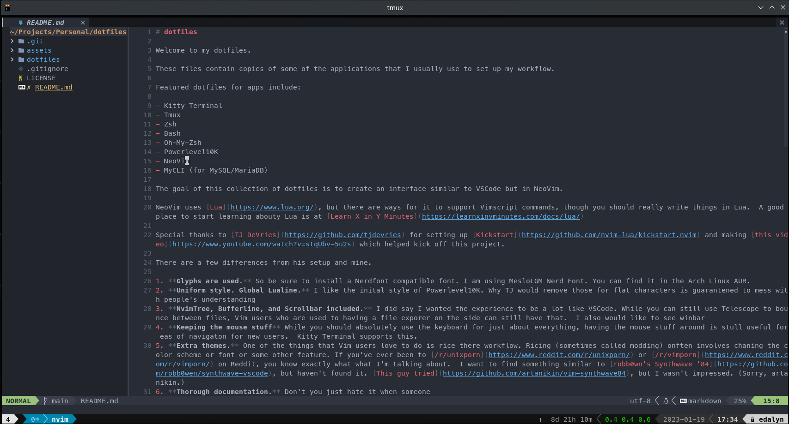

# dotfiles

Welcome to my dotfiles.

These files contain copies of some of the applications that I usually use to set up my workflow.

Featured dotfiles for apps include:

- Kitty Terminal
- Tmux
- Zsh
- Bash
- Oh-My-Zsh
- Powerlevel10K
- NeoVim
- MyCLI (for MySQL/MariaDB)

The goal of this collection of dotfiles is to create an interface similar to VSCode but in NeoVim.

NeoVim uses [Lua](https://www.lua.org/), but there are ways for it to support Vimscript commands, though you should really write things in Lua.  A good place to start learning abouty Lua is at [Learn X in Y Minutes](https://learnxinyminutes.com/docs/lua/) 

Special thanks to [TJ DeVries](https://github.com/tjdevries) for setting up [Kickstart](https://github.com/nvim-lua/kickstart.nvim) and making [this video](https://www.youtube.com/watch?v=stqUbv-5u2s) which helped kick off this project.

There are a few differences from his setup and mine.

1. **Glyphs are used.** So be sure to install a Nerdfont compatible font. I am using MesloLGM Nerd Font. You can find it in the Arch Linux AUR.
2. **Uniform style. Global Lualine.** I like the inital style of Powerlevel10K. Why TJ would remove those for flat characters is guarantened to mess with people's understanding
3. **NvimTree, Bufferline, and Scrollbar included.** I did say I wanted the experience to be a lot like VSCode. While you can still use Telescope to bounce between files, Vim users who are used to having a file exporer on the side can still have that.  I also would like to see winbar
4. **Keeping the mouse stuff** While you should absolutely use the keyboard for just about everything, having the mouse stuff around is stull useful for eas of navigaton for new users.  Kitty Terminal supports this.
5. **Extra themes.** One of the things that Vim users love to do is rice there workflow. Ricing (sometimes called modding) onften involves chaning the color scheme or font or some other feature. If you've ever been to [/r/unixporn](https://www.reddit.com/r/unixporn/) or [/r/vimporn](https://www.reddit.com/r/vimporn/) on Reddit, you know exactly what what I'm talking about.  I want to find something similar to [robb0wn's Synthwave '84](https://github.com/robb0wen/synthwave-vscode), but haven't found it. [This guy tried](https://github.com/artanikin/vim-synthwave84), but I wasn't impressed. (Sorry, artanikin.)
6. **Thorough documentation.** Don't you just hate it when someone
7. **Helpful Scripts**

And that's just for starter. I'll be sure to list more stuff later.

## TODO List

- [ ] make sure that text doesn't get stuck under scrollbar. (I've noticed that the last character of a line get's stuch under the scrollbar. Please fix that!)
- [ ] Set up Winbar to have tabs be window specific. Have it also use a row for a breadcrumb layout.
- [ ] For some reason, NvimTree isn't global appearing in all tabs. (Probably because it is not global.) Fix that.
- [ ] Prettier support.
- [ ] I'm writing this file in markdown, but where's my autotext?
- [ ] How do I manipulate files if I don't have things wrapped in Tmux?
    - You can execute `git` commands without leaving `nvim`. This is likely thanks to [Vim Fugitive](https://github.com/tpope/vim-fugitive). Instead of typing `git [whatever git command]`, you use `:Git [whatever git command]`. The icons in NVimTree should indicate which files have been staged and which files haven't.
- [ ] Rather than have those Git icons appear next to the file Icon, can we show them on the left side of of NvimTree?
- [ ] What should users Install?
- [ ] What should users install if they aren't using Arch Linux or a linux repo like Arch?
- [ ] What should users install if they aren't using Linux (esp. if they have Windows?)
- [ ] [Emmet](https://emmet.io/) support. Come on, Neovim people. Vim has this. VSCode has it. Why doesn't Neovim have it?

## Help with some of these files
* The config file for Kitty (`~/.config/kitty/kitty.conf`) uses Vim folds to organize stuff. To "unfold" everying, type `zR` in the command to view stuff.
* Kitty terminal also doesn't have a version for Windows. There's a fork of Putty called Kitty, but it is not Kitty. Windows Terminal doesn't seem to have a lot of the things Kitty has, which is unfortunate.
* When you add new plugins to the in the Neovim config file (`~/.config/nvim/init.lua`) that hasn't been initialized, you might get a message saying that a package was not found whey you try saving the config file. This is normal. It looks scary, and you can still save stuff. You just need to quit Neovim and start it back up again.
* If your color scheme hasn't set the window split separator to look nice, use `:highlight WinSeparator guibg=None` to get rid of that background. Most should have that now.
* Defintely give [Telescope](https://github.com/nvim-telescope/telescope.nvim) a try. You can call it up with `:Telescope`. The goal of using it should be similar to using CTRL+P in VSCode. Vim users might remember the CTRL+P plugin. Same purpose. Telescope was one of the plugins that came with Kickstart, but I kept it because I like it.
* If you don't know what the `<leader>` is, they are talking about the colon (`:`) that typically starts a Vim command in command mode.
* You should create a `~/.bash_aliases` file to use with `~/.bashrc` and `~/.zshrc`

